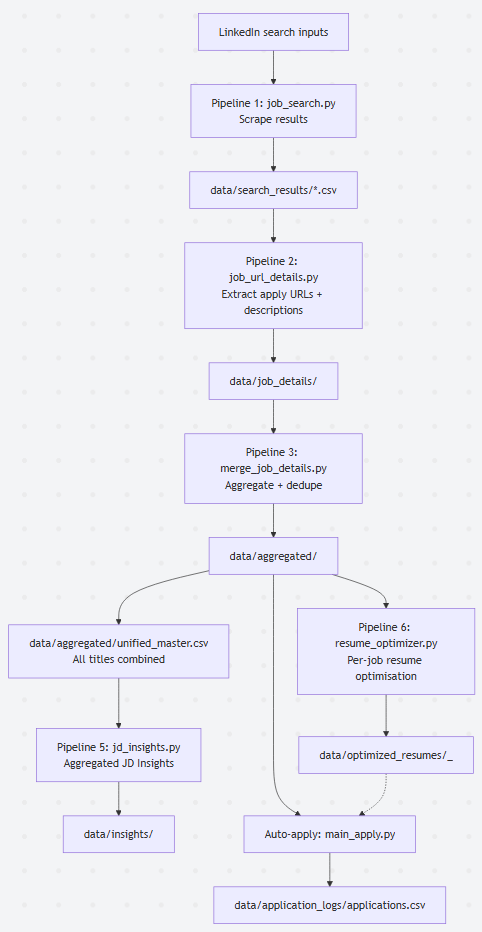

# Project JobXplorer

**Status Quo** - The project's current state is from a historical development session that had set up various features and processes to extract jobs, collect insights and tracking details, and allow for optimizing and submitting applications - including a user interface dashboard.

### Key Notes

**Session 1 (Previous Development)** - I'll refer to Session 1 development and operations as a reference to the first build session that took place originally; currently, we are using it as a starting point to *continue* development; although any changes in both directions (remove, append, optimize, modify, etc.) of the codebase is permitted - some of the documentation-based files can be found under @session-1-docs directory.

## Objective & Core Goals

**Context**: I'd like to pick up a project that exists in this directory and expand on it for job exploring job opportunities.

The objective of this project is to build a web app (afterwards a mobile app version) that will serve as a specialized utility for finding jobs related to the scope of data analytics, analysis, management.

The current build contains various features related to finding jobs, collecting job insights, tracking job details and collections, and assisting in optimizing the resume and submitting your application - all done via a user interface (dashboard); it also includes a previous version of running these steps via the terminal (which should be archived).

However, zooming out and looking at this project from an overview of what currently exists and what remains to be built - we can refer to the component mapping below.

## Components Builds

### **Component 1**: Job Research & Insights

- **Description**: This component is focused on providing several sub-components that serve as an end-to-end pipeline to discover new jobs (based on custom filters); where the process would parse through LinkedIn search results, store relevant jobs, analyze the job details and extract insights, provide statistical data views of insights, help optimize the resume based on the insights, and provide automation (auto-fill) when going through the application steps; via a user interface (dashboard) environment

    - **Context Files**: You can find several files created as documentation under @session-1docs for your reference; there is also a more historical build (and various components that are still to be utilized) under @archives; components that are pending to be integrated are under @CareerFlow - these are responsible for parsing and extracting data points related to company details and finding contact information via Apollo.io and LinkedIn

#### **Notes & Instructions**

- Continuing with this project - and this component/feature specifically, it's important to note that we do not need to keep everything as it is; we may want to change what data we store, how we store it, etc. as we re-evaluate this stage of the build

### **Component 2**: ...

