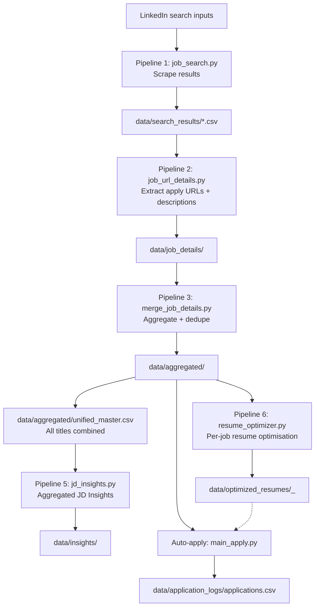

# Setup checklist

> This checklist covers **two independent workflows** that share the same codebase:
> - **[Section A]** The original CLI pipeline (`src/`) — local, file-based, single-user
> - **[Section B]** The SaaS web app (`apps/`) — Docker-based, web UI + Chrome extension

---

## Section A — CLI Pipeline

### A-1) Prereqs (one-time)

- **Activate environment**: `source venv/bin/activate`
- **Install dependencies**: `python -m pip install -r requirements.txt`
- **Chrome/Chromium installed** (used by Selenium/undetected-chromedriver)
- **X server / virtual display required** — LinkedIn scraping opens a real browser window. On a headless server, start Xvfb first:
  ```bash
  export DISPLAY=:1
  # or use your X server's display number
  ```
  The `--headless` flag exists but LinkedIn frequently blocks headless Chrome. Use the X server approach for reliability.

### LinkedIn cookies (required for scraping)
- Generate cookies (one-time or when expired):
  ```bash
  python3 src/job_extraction/manual_login.py
  ```
  Writes: `config/linkedin_cookies.txt`

### Optional: LLM extraction
- Set `OPENAI_API_KEY` in your shell (used by JD variable extraction, alignment index generation, and resume optimization)
- Without it, `resume_optimizer.py` falls back to keyword-match heuristics

### Optional: Simplify autofill
- Use a persistent Chrome profile that has the Simplify extension installed
- Setup once:
  ```bash
  python3 src/auto_application/main_apply.py \
    --csv_file "<path>" \
    --setup_simplify_profile \
    --chrome_user_data_dir "<profile_dir>" \
    --keep_user_data_dir
  ```
- Find extension IDs:
  ```bash
  python3 src/auto_application/list_extensions.py --chrome_user_data_dir "<profile_dir>"
  ```

### Auto-apply user config (required for applying)
- If `config/user_config.json` already exists, verify it is still current before running:
  ```bash
  cat config/user_config.json
  ```
- To create or recreate interactively:
  ```bash
  python3 src/auto_application/setup_config.py
  ```
  Config file: `config/user_config.json`

### Optional: Quick prereq check
```bash
python3 src/auto_application/check_prereqs.py
```

### Alignment index (required for Pipeline 5.5)
Pipeline 5.5 needs a `master_input_index.json` to exist before it can score jobs.
If running for the first time or targeting a new job title, generate it first:
```bash
source venv/bin/activate
export PYTHONPATH="$(pwd)/src"
export OPENAI_API_KEY="sk-..."   # required for this step
python3 src/job_extraction/input_index_generator.py --job_title "YOUR JOB TITLE"
# Writes: data/alignment/master_input_index.json
```
On subsequent runs for the same title this is skipped automatically.

---

### A-2) End-to-end pipeline (recommended order)

#### Step A: Job search + enrichment + merge + insights + alignment + resume optimization
```bash
./scripts/run_get_jobs.sh
```
This single command executes **6 pipelines** in sequence:

1. **Pipeline 1 – Job Search**: Scrapes LinkedIn results → `data/search_results/`
2. **Pipeline 2 – URL Details**: Extracts apply URLs + descriptions → `data/job_details/<title>/`
3. **Pipeline 3 – Merge & Dedupe**: Aggregates + deduplicates → `data/aggregated/<title>/` + rebuilds the **unified master** (`data/aggregated/unified_master.csv`) combining all job titles
4. **Pipeline 5 – Aggregated JD Insights**: Extracts keywords, skills, tools, phrases, topics from all new job descriptions. Maintains cumulative counts and category breakdowns → `data/insights/<title>/`
5. **Pipeline 5.5 – Alignment Scoring**: Scores each job description against your resume + supplementary terms. Produces alignment grades (A+ through D), gap analysis, and detailed match reports → `data/alignment_scores/<title>/`
6. **Pipeline 6 – Resume Optimization**: For each job with a description+URL, generates a tailored resume (reordered skills, optimised summary, reranked bullets). Uses OpenAI if `OPENAI_API_KEY` is set, otherwise keyword-match fallback → `data/optimized_resumes/`

> **Note**: `run_get_jobs.sh` automatically activates the venv and sets `PYTHONPATH`.
> You do **not** need to activate the venv manually before running it.

#### Step B: Apply (Simplify-assisted)
The shell script (`run_auto_apply.sh`) does not support `--use_simplify`. Call `main_apply.py` directly for Simplify mode:

```bash
source venv/bin/activate
export PYTHONPATH="$(pwd)/src"

# Simplify-assisted (recommended) — defaults to unified_master.csv
python3 src/auto_application/main_apply.py \
  --use_simplify \
  --chrome_user_data_dir "$HOME/.config/jobxplore-chrome" \
  --keep_user_data_dir

# Or specify a CSV and limit
python3 src/auto_application/main_apply.py \
  --csv_file data/aggregated/unified_master.csv \
  --use_simplify \
  --chrome_user_data_dir "$HOME/.config/jobxplore-chrome" \
  --keep_user_data_dir \
  --limit 10
```

The shell script is still useful for non-Simplify runs (headless, auto-submit):
```bash
./scripts/run_auto_apply.sh --headless --limit 10
./scripts/run_auto_apply.sh --csv_file <path> --limit 10 --headless --auto_submit
```

Results: `data/application_logs/applications.csv`
Optimised resume JSONs available in `data/optimized_resumes/` for reference during autofill.

#### Standalone: Run insights or resume optimization independently
```bash
# JD Insights only
python3 src/job_extraction/jd_insights.py --job_title "JOB_TITLE"

# Alignment scoring only
./scripts/run_alignment_scoring.sh "JOB_TITLE"
./scripts/run_alignment_scoring.sh --refresh-index --reset-title "JOB_TITLE"

# Resume optimization only
python3 src/auto_application/resume_optimizer.py --job_title "JOB_TITLE"

# Legacy: individual JD variable extraction (still available)
python3 src/auto_application/extract_jd_variables.py \
  --job_title "TITLE" --company "COMPANY" --description_file "PATH_TO_JD"

# Legacy: NLP analysis with separate venvs
./scripts/run_job_analysis.sh "JOB_TITLE"
```

---

### A-3) Data + logic flow (current)



---

### A-4) Storage locations

- Cookies: `config/linkedin_cookies.txt`
- User config: `config/user_config.json`
- Resumes (input): `config/resumes/`
- Raw search outputs: `data/search_results/`
- Job detail extractions: `data/job_details/<job_title>/`
- **★ Unified master (all titles)**: `data/aggregated/unified_master.csv`
  - Includes a `search_title` column to trace each row's origin
- Per-title aggregated: `data/aggregated/<job_title>/`
- **Alignment index**: `data/alignment/master_input_index.json`
- **JD Insights (cumulative)**: `data/insights/<job_title>/`
  - Cumulative JSON: `<title>_cumulative_insights.json`
  - CSV reports: `insights/<title>/reports/` (per-category breakdowns)
  - Processed-URL tracker: `<title>_processed_urls.json`
- **Optimised resumes (per-job)**: `data/optimized_resumes/`
  - Per-job JSON: `<company>_<title>_<date>.json`
  - Tracker: `<title>_optimised_tracker.json`
- JD variables (legacy): `data/variables_extracted/`
- Analysis outputs (legacy): `data/analysis/<job_title>/`
- Application logs: `data/application_logs/applications.csv`
- Metrics: `data/metrics/`
- Debug snapshots: `data/debug/`

---

### A-5) Directory structure

```
JobXplore/
├── src/                    # All Python source code (CLI pipeline)
│   ├── paths.py            # Central path configuration
│   ├── main_get_jobs.py    # Main pipeline orchestrator
│   ├── client.py           # API client
│   ├── job_metrics_tracker.py
│   ├── job_extraction/     # Scraping & processing
│   └── auto_application/   # Auto-apply pipeline
├── config/                 # User-provided inputs
│   ├── linkedin_cookies.txt
│   ├── user_config.json
│   └── resumes/
├── data/                   # All generated outputs
│   ├── search_results/     # Raw LinkedIn search results
│   ├── job_details/        # Enriched job details
│   ├── aggregated/         # ★ Primary data (feeds auto-apply)
│   ├── alignment/          # Alignment index + scores
│   ├── insights/           # JD insights
│   ├── optimized_resumes/  # Tailored resumes
│   ├── application_logs/   # Application results
│   ├── metrics/            # Run tracking
│   ├── analysis/           # NLP analysis
│   ├── variables_extracted/
│   └── debug/              # Debug snapshots
├── scripts/                # Shell launcher scripts
├── docs/                   # Documentation
├── tools/                  # ChromeDriver, etc.
└── venv/                   # Virtual environment
```

---

### A-6) Filters and exclusions (current behavior)

#### Apply URL extraction (job_url_details)
- If no Apply button is found, the application URL is set to "Not Available".
- If the Apply button indicates LinkedIn Easy Apply, the application URL is set to "Easy Apply (LinkedIn)".

#### Auto-apply input filtering
- Jobs without a usable URL are dropped. The CSV loader keeps rows where `job_url` exists or `application_url` exists and is not "Not Available".
- Already-applied jobs are skipped using the application log (timed-out entries are allowed to re-run).

---

---

## Section B — SaaS Web App

The SaaS app replaces the CLI workflow with a multi-tenant web UI, a REST API, and a Chrome extension for autofill. It requires Docker.

### B-1) Prerequisites

| Tool | Check |
|---|---|
| Docker + Docker Compose v2 | `docker compose version` |
| Node.js 20+ | `node --version` |
| npm 10+ | `npm --version` |
| Google Chrome (for the extension) | `google-chrome --version` |

Both env files must be present:
```
apps/api/.env       — DATABASE_URL, SUPABASE_*, ENCRYPTION_KEY, REDIS_URL, CORS_ORIGINS
apps/web/.env.local — NEXT_PUBLIC_SUPABASE_URL, NEXT_PUBLIC_SUPABASE_ANON_KEY, NEXT_PUBLIC_API_URL
```

---

### B-2) First-time setup

#### Step 1: Run database migrations

This creates all tables in your Supabase database. Run once (or when new migrations are added):

```bash
cd apps/api
source .venv/bin/activate   # or use the Docker method below
alembic upgrade head
```

> **Alternative — no local venv needed:**
> ```bash
> cd docker
> docker compose up -d db
> docker compose run --rm api alembic upgrade head
> ```

Migrations applied (in order):
- `001` — Core tables: users, jobs, resumes, search_configs, pipeline_runs, alignment_scores, insights, optimized_resumes
- `002` — Supplementary terms column on users
- `003` — application_logs table
- `004` — notifications table

To check current migration state:
```bash
docker compose run --rm api alembic current
```

#### Step 2: Start all services

```bash
cd docker
docker compose up -d
```

Services:

| Service | Port | Purpose |
|---|---|---|
| `db` | 5432 | Local PostgreSQL (dev only — production uses Supabase cloud) |
| `redis` | 6379 | Celery task queue broker + result backend |
| `browserless` | 3001 | Headless Chrome for server-side LinkedIn scraping |
| `api` | 8000 | FastAPI backend |
| `worker` | — | Celery worker — executes pipeline tasks |
| `web` | 3000 | Next.js frontend |

Verify all services are up:
```bash
docker compose ps
curl http://localhost:8000/health
# → {"status":"ok","service":"JobXplore API"}
```

View logs:
```bash
docker compose logs api -f
docker compose logs worker -f
docker compose logs web -f
```

---

### B-3) First use — account setup

#### Step 1: Sign up
1. Open `http://localhost:3000`
2. Click **Sign Up** — enter email + password
3. Check your email for the Supabase confirmation link and confirm it
4. Sign in — you are redirected to `/onboarding`

#### Step 2: Onboarding wizard
Fill in your personal details (name, phone, location, LinkedIn URL) and work authorization status. This populates your profile so the Chrome extension can autofill forms.

#### Step 3: Settings — complete your profile
Go to **Settings** and fill in all tabs:

| Tab | What to fill |
|---|---|
| Personal | First/last name, phone, city, zip, LinkedIn URL |
| Application | How you heard about roles, metro area |
| Disclosures | Gender, race/ethnicity, veteran status, disability (optional — used for EEO forms) |
| Preferences | Default salary range, job type, remote preference |
| Integrations | OpenAI API key (required for LLM resume optimization), LinkedIn cookies upload |

#### Step 4: Upload your base resume
1. Go to **Resumes**
2. Click **Upload Resume** — select your PDF
3. Mark it as **Default** — this is what the pipeline uses for optimization

#### Step 5: Upload LinkedIn cookies
Required for the scraping pipeline. Generate fresh cookies:
```bash
# CLI method (opens a browser window)
source venv/bin/activate
export PYTHONPATH="$(pwd)/src"
python3 src/job_extraction/manual_login.py
# Saves to: config/linkedin_cookies.txt
```
Then upload via the web app: **Settings → Integrations → LinkedIn Cookies → Upload File**

---

### B-4) Running the job pipeline

#### Step 1: Create a search configuration
1. Go to **Searches** → **New Search**
2. Fill in:
   - Job title (e.g., `Marketing Analytics Manager`)
   - Salary minimum
   - Job type (`full_time`)
   - Work mode (`remote`)
3. Click **Save**

#### Step 2: Generate the alignment index (first time per job title)
The alignment index is required for scoring. It is generated via OpenAI (requires `OPENAI_API_KEY` in Settings → Integrations).

1. Go to **Alignment → Setup**
2. Enter your target job title
3. Click **Generate Index** — this kicks off a background task (~30–60 seconds)
4. Optionally add supplementary terms (skills not on your resume that you want to boost)

#### Step 3: Run the pipeline
1. Go to **Pipelines**
2. Click **Run Pipeline**
3. Select your search config
4. Click **Start**

Pipeline stages run in sequence via Celery:
1. LinkedIn scrape (via Browserless) → jobs stored in DB
2. Job detail extraction (apply URLs + descriptions)
3. JD insights (keyword extraction)
4. Alignment scoring (grades each job A+ through D)
5. Resume optimization (tailored resume per job)

Monitor progress on the Pipelines page. Status updates automatically.

> **Note on LinkedIn scraping**: The `browserless` Docker service handles the X server requirement — you do not need to run Xvfb separately for the SaaS pipeline.

#### Step 4: Review results
- **Jobs** — browse scraped listings, filter by company or alignment grade
- **Alignment** — sorted by score; top matches highlighted
- **Resumes → Optimized** — per-job tailored resumes; download as PDF
- **Insights** — keyword/skill frequency across all scraped JDs

---

### B-5) Installing and using the Chrome extension

#### Build the extension
```bash
cd apps/extension
npm install
npm run build
# Output: apps/extension/dist/
```

#### Load in Chrome
1. Open `chrome://extensions`
2. Enable **Developer mode** (top-right toggle)
3. Click **Load unpacked** → select `apps/extension/dist/`
4. The JobXplore icon appears in the toolbar

#### Configure the extension
1. Click the extension icon → popup opens
2. Set **API URL**: `http://localhost:8000`
3. Sign in with your JobXplore credentials (or paste your JWT from the web app session)

#### Using autofill
1. Find a job in the **Jobs** page with a supported ATS apply URL
2. Click the apply link — the ATS page opens in Chrome
3. Click the JobXplore extension icon → **Fill This Form**
4. The extension fills personal info, uploads your resume, and answers screening questions
5. **Review all fields before submitting** — the extension intentionally stops before final submission
6. Submit manually

Supported ATS boards: **Greenhouse, Workday, Lever, SmartRecruiters, LinkedIn Easy Apply**

After applying, the extension logs the result automatically. It appears in **Analytics** and increments your application count.

---

### B-6) Notifications

The Chrome extension polls `/api/v1/notifications/count` every 5 minutes.

- When a pipeline run completes and finds jobs with alignment score ≥ 0.75, a notification is created
- The extension badge shows the unread count
- A system notification fires if there are unread items
- In the web app, the bell icon in the header shows the notification panel

---

### B-7) Analytics

Go to **Analytics** to view:
- Application counts over time (line chart)
- Breakdown by ATS board (bar chart)
- Breakdown by status — submitted / filled / failed (pie chart)
- Recent application log table

Use the period buttons to filter: **Today / This Week / Month / 3 Months / YTD / All Time**

---

### B-8) Stopping and restarting

```bash
# Stop all services (data is preserved)
cd docker
docker compose stop

# Restart
docker compose start

# Stop and wipe all local data (destructive — resets local DB only, not Supabase cloud)
docker compose down -v
```

To update after code changes:
```bash
docker compose build api web worker
docker compose up -d
```

---

### B-9) SaaS directory structure

```
apps/
├── api/                    # FastAPI backend
│   ├── src/
│   │   ├── main.py         # Entry point
│   │   ├── models/         # SQLAlchemy models (10 tables)
│   │   ├── routers/        # REST API (12 routers)
│   │   ├── schemas/        # Pydantic request/response schemas
│   │   ├── tasks/          # Celery task chain (pipeline orchestration)
│   │   ├── core/           # Pure-function pipeline logic (shared with src/)
│   │   └── services/       # Storage (Supabase), browser, encryption, PDF
│   ├── tests/              # pytest test suite (unit + integration)
│   └── requirements.txt
├── web/                    # Next.js 15 frontend
│   └── src/app/
│       ├── (auth)/         # login, signup, onboarding, reset-password
│       └── dashboard/      # jobs, searches, resumes, alignment, pipelines, analytics, settings
├── extension/              # Chrome MV3 extension
│   └── src/
│       ├── popup/          # Extension UI
│       ├── content/        # Form fillers (Greenhouse, Workday, Lever, SmartRecruiters, LinkedIn)
│       └── background/     # Service worker, alarm-based notification polling
docker/
├── docker-compose.yml      # 6-service dev stack
├── Dockerfile.api
├── Dockerfile.worker
├── Dockerfile.web
└── Dockerfile.api.test     # Test image
migrations/
└── versions/               # 001 → 004 Alembic migrations
```
